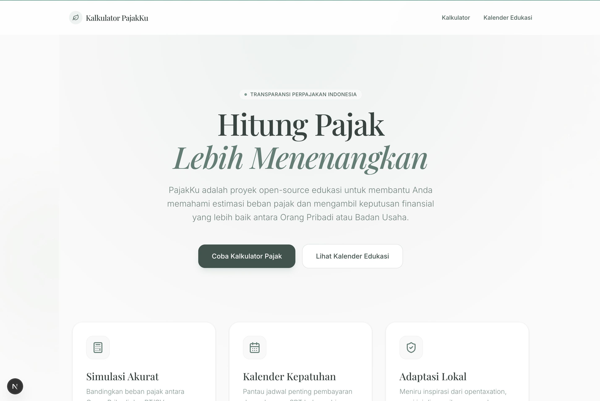

# PajakKu 🇮🇩

> **Perbandingan Pajak Pribadi & Badan Instan**

PajakKu adalah platform edukasi perpajakan open-source yang membantu pengusaha dan individu di Indonesia untuk mensimulasikan dan membandingkan beban pajak antara Orang Pribadi dan Badan Usaha (PT/CV) secara transparan, akurat, dan mudah dipahami.

Website ini dibangun sebagai alat bantu edukasi agar urusan pajak tidak lagi membingungkan.



## Fitur Utama ✨

- **Kalkulator Perbandingan Pajak**: Masukkan estimasi laba bersih dan gaji direktur, dan sistem akan langsung merekomendasikan skema mana (Orang Pribadi atau Badan) yang paling hemat dan optimal untuk bisnis Anda. Termasuk perhitungan:
  - PTKP (Penghasilan Tidak Kena Pajak)
  - PPh 21 (Pajak Gaji)
  - Pajak Dividen
- **Kalender Edukasi Pajak 2026**: Panduan batas waktu penyetoran dan pelaporan pajak bulanan serta tahunan.
- **Ekspor Kalender**: Tambahkan jadwal tenggat waktu pajak langsung ke kalender kalender digital Anda (Apple Calendar, Google Calendar, Outlook) melalui file format `.ics`.
- **UI Modern & Bersih**: Dibangun menggunakan antarmuka Glassmorphism elegan dengan warna brand yang menenangkan untuk memandu user step-by-step.

## Tech Stack 🛠

- **Framework:** Next.js 16 (App Router)
- **Styling:** Tailwind CSS v4, Vanilla CSS
- **Komponen:** Shadcn UI, Radix UI Primitive
- **Ikon:** Lucide React
- **Bahasa:** TypeScript

## Menjalankan secara Lokal 🚀

Pastikan Anda sudah menginstall [Bun](https://bun.sh/) atau Node.js.

1. Install dependensi:

```bash
bun install
```

2. Jalankan development server:

```bash
bun dev
```

3. Buka browser Anda di [http://localhost:3000](http://localhost:3000).

## Deployment

Aplikasi Next.js ini sudah siap di-deploy secara mudah melalui platform seperti [Vercel](https://vercel.com/) atau Netlify.

## Kontribusi

Kontribusi selalu diterima! Perbaikan bug, usulan fitur, pembaruan data pajak dari DJP, atau peningkatan algoritma perhitungan pajak Indonesia dapat diajukan melalui Issues atau Pull Requests.

Dibuat dengan ❤️ untuk edukasi pajak yang lebih baik di Indonesia.
